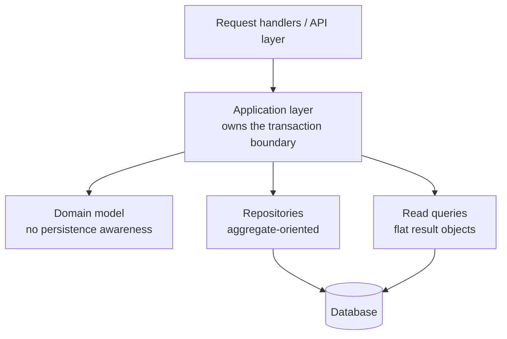

# ADR-004: Data Access Pattern
 
| Field | Value |
|---|---|
| **Status** | Proposed |
| **Date** | 2026-08-05 |
| **Deciders** | *[Architecture group / tech leads]* |
| **Consulted** | *[Platform, Data, SRE, Security]* |
| **Informed** | *[Engineering org]* |
| **Supersedes** | — |
| **Superseded by** | — |
 
> **Scope note.** This ADR decides *how application code accesses persistent data* — the pattern, its boundaries, and transaction ownership. Selection of a specific ORM, data-mapping library, or database product is deliberately deferred to a separate decision, so this record remains valid if the underlying technology is replaced.
 
---
 
## 1. Context
 
*[Replace bracketed text with your specifics.]*
 
Data access is currently *[describe: embedded in request handlers / spread across service classes / a mixture of ORM calls and hand-written queries]*.
 
Forces driving a decision now:
 
- **No single place to change.** Queries against the same data are written repeatedly in different components with different filters, projections, and correctness assumptions. A schema change requires finding every one of them, and the search is manual.
- **Business logic is coupled to persistence.** Domain rules cannot be read, reasoned about, or tested without a database, so unit tests are slow, fragile, and require fixture data that drifts from production shape.
- **Transaction boundaries are unclear.** Different components commit at different points; some operations that should be atomic are not, and nobody can determine which without reading the call graph.
- **Query performance defects are found in production.** Lazy loading inside iteration produces N+1 query patterns that are invisible in review and only appear under real data volume.
- **Cross-cutting policy has no home.** Timeouts, retry behaviour, connection pooling, and read/write routing are configured inconsistently or not at all, so a slow query in one component can exhaust the pool for all of them.
- **Sensitive data handling cannot be verified.** With access scattered, there is no chokepoint at which to apply masking, row-level filtering, or audit logging for *[regulated data]*.
## 2. Decision
 
**We will use the repository pattern as the sole mechanism for persistent data access, with transaction boundaries owned by the application layer and a separate explicit path for complex reads.**
 
Concretely:
 
1. **All persistence access goes through a repository.** No queries, no connections, and no persistence-framework types in request handlers, domain logic, or presentation code. The persistence package is the only place aware of how data is stored.
2. **Repositories are domain-oriented, not table-oriented.** One repository per aggregate — the consistency boundary — not one per table. Methods express domain intent (`findActiveSubscriptionsFor`, `save`) rather than storage mechanics (`selectWhere`, `updateRow`). A repository per table reproduces the schema in the code and delivers none of the benefit.
3. **Repositories return domain objects, never persistence types.** Framework entities, result sets, cursors, and lazily-evaluated query builders do not cross the repository boundary. **Returning an open query object is the most common way this pattern is defeated** — it moves query construction back into the caller while appearing to comply.
4. **Transactions are owned by the application layer, not by repositories.** A repository never commits. The unit of work spanning one or more repository operations is opened and committed by the calling use case, so the atomic boundary is visible at the point where the business operation is expressed.
5. **Two explicit paths, chosen deliberately:**
   - **Write path** — object mapping through repositories, loading whole aggregates, enforcing invariants in the domain.
   - **Read path** — for reporting, list views, and any query spanning several aggregates, purpose-built read queries returning flat result objects shaped for the caller. These live in the persistence package alongside repositories but do not pretend to be repositories.
   Forcing complex reads through aggregate repositories produces over-fetching and contorted mapping code; forcing writes through ad-hoc queries loses invariant enforcement. **The failure mode this rule prevents is picking one path and using it for everything.**
6. **No lazy loading across the repository boundary.** Loading strategy is stated explicitly at the call site. Related data is either included deliberately or fetched deliberately. This eliminates N+1 patterns as a class rather than detecting them case by case.
7. **Pagination is mandatory on any collection query.** No repository method returns an unbounded collection. Every list-returning method takes a limit, and a default limit applies if none is given.
8. **Persistence models may diverge from domain models where they need to.** Where the storage shape and the domain shape differ meaningfully, a mapping layer is introduced and the mapping cost is accepted. Where they do not differ, a shared representation is acceptable — **premature separation is as expensive as premature coupling**, and this choice is made per aggregate, not globally.
9. **Cross-cutting policy lives in the persistence package**: connection pooling, statement timeouts, retry on transient errors only *[never on writes without idempotency guarantees]*, read/write routing, query logging, and masking or filtering of *[regulated data]*.
10. **Schema changes are versioned, forward-only, and backward-compatible during deployment.** Migrations are applied automatically and follow expand/contract: add the new shape, migrate, switch reads, then remove the old shape in a later release. No deployment requires the application and schema to change simultaneously.
### Layering
 

 
## 3. Alternatives Considered
 
| Option | Why not chosen |
|---|---|
| **Direct data access in handlers** | Fastest to write and perfectly adequate for a small service with simple, stable queries. Rejected because it provides no chokepoint for policy, no seam for testing, and no bound on query duplication — the exact problems in §1. |
| **Active Record** (domain objects manage their own persistence) | Excellent developer velocity, especially for CRUD-shaped applications, and the right choice for many systems. Rejected because domain objects become untestable without a database and inseparable from the schema, which is a poor fit given *[complexity of business rules / need for fast unit tests]*. |
| **DAO per table** | Provides a persistence seam but organises it by storage structure rather than by consistency boundary. Callers must then assemble aggregates themselves, which relocates domain logic into the application layer rather than removing it. |
| **Hand-written queries throughout, no mapping layer** | Maximum control over the generated query, which matters at high scale. Rejected because it produces substantial repetitive mapping code and no enforced structure, though this remains the right approach *within* the read path. |
| **Stored procedures as the data access layer** | Puts logic close to the data and can perform very well. Rejected because it splits business logic across two codebases with different testing, review, and deployment models, and materially complicates local development. |
| **Separate read store (CQRS with projections)** | The strongest answer to read/write asymmetry, but introduces a second store, a synchronisation mechanism, and eventual consistency between them. Not justified at current scale. **The read/write path separation in decision 5 is deliberately the same idea at a fraction of the cost, and leaves this available later.** |
 
## 4. Consequences
 
### Positive
 
- One place to change when the schema changes, and one place to look when a query misbehaves.
- Domain logic is testable without a database, so unit tests are fast enough to run continuously.
- Transaction boundaries are visible in the use case rather than inferred from the call graph.
- Cross-cutting policy — timeouts, retries, masking, audit — is applied at a genuine chokepoint and can be verified.
- Query performance is reviewable, because query construction is confined to one package rather than distributed through business logic.
- The storage technology can be changed for a given aggregate without touching domain or application code — which is a real if infrequently exercised benefit.
### Negative
 
- **Indirection cost.** A trivial read now traverses an interface it did not need. For simple CRUD aggregates this is pure overhead, and developers will correctly perceive it as ceremony.
- **Mapping code.** Where persistence and domain models diverge, translation must be written and maintained on both sides.
- **The abstraction leaks under performance pressure.** Sooner or later a query needs a database-specific feature, and the choice is between a leaky repository method and a worse query. This is a known limit of the pattern, not a defect in the implementation.
- **Two paths require judgement.** Deciding whether something is a write-path or read-path concern is a recurring design decision, and teams will get it wrong in both directions before the boundary settles.
- **Discipline is required to keep the boundary intact.** The pattern degrades silently — one repository returning a query object, one handler opening its own connection — and the degradation is invisible without automated enforcement. **This is the main reason the pattern fails in practice, which is why §6 is not optional.**
- **Aggregate-level loading can over-fetch.** Loading a whole aggregate to change one field is wasteful where aggregates are large.
### Neutral / Follow-on
 
- Selection of mapping technology, query builder, and migration tooling remain separate decisions constrained by this one.
- Adoption can be incremental: new code follows the pattern, existing code is converted when touched.
- A separate read store remains available later without invalidating this decision.
## 5. Trade-offs at a Glance
 
| Concern | Effect |
|---|---|
| Testability | Substantially improved — domain logic testable without infrastructure |
| Evolvability | Improved — schema and storage changes localised |
| Consistency of policy | Substantially improved — a real enforcement point exists |
| Query performance | Neutral to improved, provided the read path is used as intended |
| Simplicity | Reduced — more layers, more files, more indirection |
| Initial velocity | Reduced — noticeably so for simple CRUD work |
 
**Explicitly traded away:** simplicity and short-term velocity, in exchange for testability, localised change, and enforceable policy. For a small service with simple, stable data access, this trade is not worth making.
 
## 6. Implementation Notes
 
- **Naming:** repositories named for the aggregate (`OrderRepository`), read queries named for the question they answer (`OrderSummaryQuery`).
- **Interface ownership:** the repository interface belongs to the domain or application layer; the implementation belongs to the persistence package. This is what keeps the dependency pointing inward.
- **Bulk operations** are an explicit, documented exception — loading a million aggregates to update a field is not a defence of the pattern. Bulk paths are named as such, reviewed individually, and kept in the persistence package.
- **Test doubles:** in-memory repository implementations for domain and application tests; a real database for repository tests. Do not test repositories against a fake — the mapping is precisely what needs testing.
- **Query count assertions** in integration tests for critical paths, to catch N+1 regressions before production rather than after.
- **Read-only connections** for the read path where the infrastructure supports it, so an accidental write is impossible rather than merely discouraged.
- **Migration review:** every migration is reviewed for lock behaviour on production-sized tables. A migration that is instant on a development dataset can lock a large table for minutes.
## 7. Compliance and Enforcement
 
- Static analysis or dependency rules fail the build when persistence-framework imports appear outside the persistence package.
- Automated check that no repository method returns a persistence or query-builder type.
- Automated check that collection-returning repository methods accept a pagination parameter.
- Integration tests assert query counts on *[designated critical paths]*.
- Code review confirms that new data access chose the write path or the read path deliberately, rather than by habit.
## 8. Review Triggers
 
Revisit this decision if:
 
- The proportion of repository methods that exist purely to expose a storage-specific capability exceeds *[20%]* — the abstraction is no longer paying for itself.
- Read-path queries routinely need data the write model does not hold, indicating a separate read store is now justified.
- Mapping code becomes a significant maintenance burden relative to the domain logic it serves.
- Aggregate boundaries prove wrong — visible as transactions routinely spanning multiple repositories.
- Team feedback consistently identifies the pattern as ceremony rather than structure on *[a majority of]* services, suggesting it is being applied where it is not warranted.
