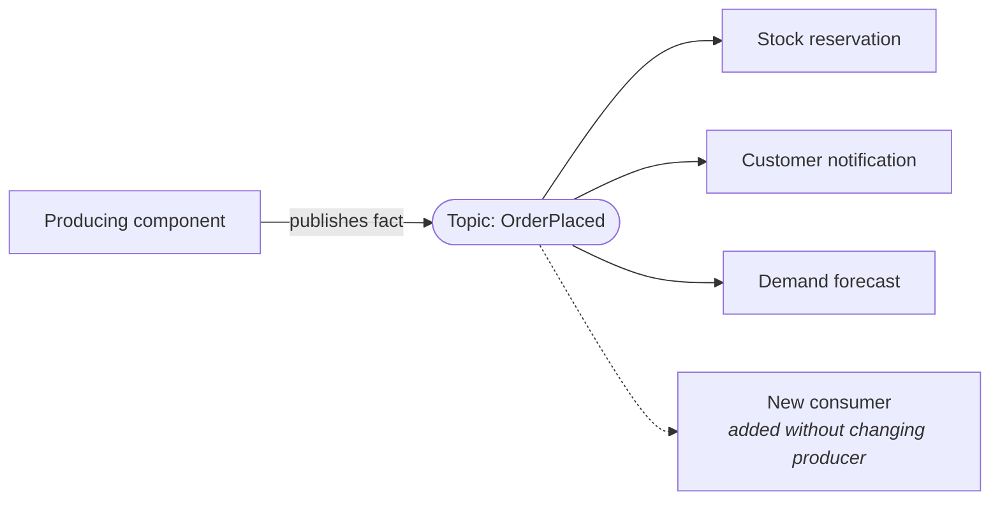

# ADR-003: Adopt Event-Driven Architecture
 
| Field | Value |
|---|---|
| **Status** | Proposed |
| **Date** | 2026-08-05 |
| **Deciders** | *[Architecture group / tech leads]* |
| **Consulted** | *[Platform, SRE, Security, Data]* |
| **Informed** | *[Engineering org, Product]* |
| **Supersedes** | — |
| **Superseded by** | — |
 
> **Scope note.** This ADR decides the *architectural style* — asynchronous, event-based communication between components. Selection of a specific broker, messaging product, or serialisation format is deliberately deferred to a separate decision, so that this record remains valid if the underlying technology is later replaced.
 
---
 
## 1. Context
 
*[Replace bracketed text with your specifics.]*
 
Components in the current system communicate through synchronous request/response calls. *[Describe: N components, M business processes, current integration style.]*
 
Forces driving a decision now:
 
- **Temporal coupling.** A caller cannot complete its work unless the callee is available and responsive. A slow downstream component propagates latency upstream; an unavailable one propagates failure. Availability is effectively the product of every component in the call path.
- **Change amplification on fan-out.** When a business fact needs to reach a new consumer (*[e.g. a new analytics, notification, or compliance process]*), the producing component must be modified, retested, and redeployed. The producer accumulates knowledge of every consumer, and the cost of adding the *n*th consumer grows with *n*.
- **Workload spikes.** *[Describe: peak vs average load ratio.]* Synchronous processing forces the system to be sized for peak, because there is no mechanism to absorb a burst and drain it at a sustainable rate.
- **Reactive business processes.** Several processes are naturally "when X happens, do Y and Z" (*[e.g. order placed → reserve stock, notify customer, update forecast]*). Modelling these as synchronous call chains puts orchestration logic inside the component that happened to trigger it, which is not where it belongs.
- **Latency of derived data.** Downstream views (*[reporting, search indexes, caches]*) are refreshed by *[nightly batch / polling]*, giving a staleness window of *[X hours]* that the business increasingly will not accept.
- **No record of what happened.** The system records current state, not the sequence of facts that produced it, limiting audit, debugging, and retrospective analysis.
## 2. Decision
 
**We will adopt an event-driven architecture for communication between components, using asynchronous events as the primary integration mechanism.**
 
Concretely:
 
1. **Events are immutable facts about the past.** Named in the past tense (`OrderPlaced`, `PaymentSettled`, `AddressChanged`), describing something that has already happened. An event is not a command, not a request, and carries no expectation of a response. Producers do not know or care who consumes them.
2. **Publish/subscribe, not point-to-point.** Producers publish to a named topic; any number of consumers subscribe independently. Adding a consumer requires no change to the producer — this is the primary benefit being purchased.
3. **Broker topology by default; mediator where coordination is required.** Simple reactive flows are choreographed: components react to events and publish their own. Business processes requiring multi-step coordination, compensation, or an explicit state machine use a mediator component that owns the process definition. **The default is choreography; a mediator must be justified by genuine workflow complexity.**
4. **Event payload style is chosen per topic, and stated explicitly.**
   - *Notification* — minimal payload (identifier plus event type). Consumers call back for detail. Lowest coupling, highest read amplification.
   - *Event-carried state transfer* — payload contains the data consumers need. Removes callbacks and read-time coupling at the cost of larger payloads and duplicated state.
   - Each topic's contract declares which style it uses. Mixing styles within one topic is prohibited.
5. **Delivery is at-least-once; consumers are idempotent.** Exactly-once delivery is not assumed to be available. Every consumer must tolerate duplicate and out-of-order delivery, keyed on a deduplication identifier carried in the event envelope. This is a hard requirement, not a recommendation.
6. **Ordering is guaranteed only within a partition key.** Where ordering matters, events are keyed by *[aggregate identifier]*. Consumers must not assume global ordering across topics.
7. **Eventual consistency is accepted between components.** Strong consistency is retained only *within* a component's own transactional boundary. Multi-component business transactions use compensating actions rather than distributed transactions.
8. **Atomicity between state change and publication is guaranteed by the transactional outbox pattern.** A component writes its state change and its outgoing event in the same local transaction; a separate relay publishes from the outbox. Dual writes (commit to the database, then publish) are prohibited — they lose events on failure between the two steps.
9. **Every event carries a standard envelope:** event identifier, event type, schema version, timestamp, producing component, correlation identifier, and causation identifier. The correlation identifier propagates unchanged through every downstream event, making an entire business process traceable.
10. **Scope of adoption.** *[State clearly: all inter-component communication / only these flows: … / synchronous request-response is retained for user-facing reads and for queries requiring an immediate answer.]* Not everything should be an event — synchronous calls remain correct where the caller genuinely needs an answer before it can proceed.
### Event flow
 

 
## 3. Alternatives Considered
 
| Option | Why not chosen |
|---|---|
| **Synchronous request/response throughout** | Simplest to reason about, easiest to debug, gives immediate consistency and an immediate error to the caller. Rejected as the *primary* style because it cannot solve temporal coupling or fan-out amplification — the two dominant forces above. **Retained for queries and for interactions where the caller must have an answer to proceed.** |
| **Batch / scheduled integration** | Well understood, easy to operate, and adequate where staleness of hours is acceptable. Rejected because the required staleness window is *[minutes/seconds]*, and because batch failures are discovered late and recovered slowly. |
| **Shared database with polling** | No new infrastructure, but couples every consumer to the producer's schema, generates constant load regardless of change rate, and makes the database the integration contract — the hardest kind of contract to evolve. |
| **Point-to-point queues (no pub/sub)** | Provides asynchrony and load levelling, but the producer must still know each destination. This solves temporal coupling while leaving fan-out amplification untouched — half the benefit for most of the cost. |
| **Orchestration engine only (no events)** | Central workflow definitions are explicit and easy to inspect, which is a real advantage. Rejected as the sole mechanism because it recreates a central coordination bottleneck and re-couples the workflow owner to every participant. **A mediator is retained for genuinely complex workflows, per decision 3.** |
| **Event sourcing as the system of record** | Complete audit history and temporal query are attractive, but rebuilding state from an event log, versioning historical events, and reasoning about projections impose a large and permanent complexity cost. **Explicitly out of scope.** Publishing events is not the same decision as sourcing state from them; conflating the two is a common and expensive mistake. Revisit per-component if a specific audit requirement demands it. |
 
## 4. Consequences
 
### Positive
 
- Producers are decoupled from consumers: new consumers are added with no producer change, no producer redeployment, and no producer regression testing.
- Temporal decoupling — a consumer being down delays processing rather than failing the producer's operation. Availability stops being multiplicative.
- Load levelling: bursts are absorbed by the broker and drained at a sustainable rate, so components are sized for average rather than peak.
- Consumers scale independently, and slow consumers do not slow producers.
- The event stream is a durable record of business facts, usable for audit, debugging, replay, and analytics.
- Failure is isolated: a failing consumer affects its own processing, not the producer's or its siblings'.
### Negative
 
- **Eventual consistency is now a business-visible property**, not a technical detail. "I placed the order but it isn't in my history yet" becomes a product question requiring a designed answer (optimistic UI, explicit pending state, or a read-your-own-writes guarantee). Product and design must be involved, not just engineering.
- **No end-to-end transaction.** A business process spanning components cannot be rolled back atomically. Compensating actions must be designed for every failure point, and compensations can themselves fail.
- **Debugging is materially harder.** There is no stack trace across an asynchronous boundary. Without correlation identifiers and distributed tracing built in from the first event, incident diagnosis becomes guesswork. This tooling is a prerequisite, not a follow-up.
- **The overall business process exists nowhere explicitly.** With choreography, no artefact describes what happens when an order is placed — the behaviour is emergent across subscribers. Documentation drifts from reality unless deliberately maintained.
- **Every consumer must handle duplicates, out-of-order arrival, and poison messages.** This is real, recurring work in every consumer, and it is easy to omit until it causes a production incident.
- **Schema evolution becomes a governance problem.** A producer cannot know who depends on a field. Breaking changes are discovered by consumers failing in production unless compatibility is enforced automatically.
- **Error handling has no caller to return to.** Failures surface as dead-letter accumulation, which requires monitoring, triage ownership, and a redrive path — none of which exist by default.
- **Operational surface grows.** The broker becomes critical infrastructure with its own availability, capacity, retention, and upgrade concerns.
- **Testing shifts.** Integration correctness depends on contracts between components that are never invoked together. Contract testing becomes necessary rather than optional.
### Neutral / Follow-on
 
- Broker selection, serialisation format, and schema registry are separate decisions constrained by this one.
- Adoption can be incremental — a single flow can be converted while the rest of the system stays synchronous.
- Event sourcing and CQRS become *available* patterns, but neither is adopted by this decision.
## 5. Architecture Characteristics
 
Indicative ratings for this style (5 = strongest; *Overall cost* and *Simplicity* rated so that 5 = cheapest/simplest). Treat as a starting point for the team's own scoring, not fixed values.
 
| Characteristic | Rating | Note |
|---|---|---|
| Scalability | ★★★★★ | Consumers scale independently |
| Elasticity | ★★★★★ | Broker absorbs bursts |
| Performance | ★★★★★ | Parallel, non-blocking processing |
| Evolvability | ★★★★★ | New consumers need no producer change |
| Fault tolerance | ★★★★☆ | Failure isolated to the failing consumer |
| Modularity | ★★★★☆ | Coupling is to the contract only |
| Deployability | ★★★★☆ | Independent, contract permitting |
| Reliability | ★★★☆☆ | Duplicates, ordering, eventual consistency |
| Overall cost | ★★★☆☆ | Broker plus consumer-side complexity |
| Testability | ★★☆☆☆ | Asynchronous flows are hard to test end to end |
| Simplicity | ★☆☆☆☆ | The weakest characteristic of this style |
 
**Explicitly traded away:** simplicity, testability, and immediate consistency, in exchange for decoupling, scalability, and extensibility. If the forces in §1 do not genuinely apply, this trade is a bad one.
 
## 6. Implementation Notes
 
- **Topic naming:** `*[domain].[entity].[event-in-past-tense].v[major]*`, e.g. `sales.order.placed.v1`. Naming is fixed before the first event is published; renaming later is a breaking change for every consumer.
- **Schema compatibility:** producers may only make backward-compatible changes within a major version (add optional fields; never remove, rename, or retype). Breaking changes require a new major version published in parallel, with the old version retired only after consumer migration is confirmed.
- **Consumer error handling:** retry with exponential backoff for transient failures; route to a dead-letter destination after *[N]* attempts. Every dead-letter destination has a named owning team, an alert, and a documented redrive procedure. Unmonitored dead-letter destinations are silent data loss.
- **Idempotency:** consumers record processed event identifiers for *[retention window]* and discard repeats. Where the operation is naturally idempotent, document that rather than adding a store.
- **Retention and replay:** retain events for *[N days]* to allow a consumer to be rebuilt by replaying history. Consumers must tolerate replay — which is another reason idempotency is mandatory.
- **Observability from day one:** correlation identifier propagated through every hop; dashboards for consumer lag, dead-letter depth, and end-to-end process latency. Consumer lag is the primary health signal.
- **Documenting the process:** maintain an event catalogue listing each event type, its schema, its producer, and its known consumers. It will be imperfect, but its absence guarantees that nobody can answer "what happens when X occurs?"
- **Adoption sequence:** convert one flow with a clear fan-out problem and tolerant consistency requirements first — typically notifications or analytics, not payments. Prove the tooling before touching anything transactional.
## 7. Compliance and Enforcement
 
- Schema compatibility is checked in CI; incompatible changes fail the build rather than being caught by consumers in production.
- Envelope conformance (correlation identifier, event identifier, version) is validated at publication; non-conforming events are rejected.
- Automated check that every topic has a registered owner and every dead-letter destination has an alert.
- Architecture review confirms that new synchronous inter-component calls are deliberate and documented, not accidental drift back to the previous style.
## 8. Review Triggers
 
Revisit this decision if:
 
- Debugging asynchronous flows becomes the dominant cost of operating the system.
- The proportion of business processes requiring a mediator exceeds *[50%]*, suggesting the domain is genuinely orchestration-shaped rather than reactive.
- Consumers routinely need synchronous callbacks to the producer, indicating the wrong payload style or wrong event granularity.
- Eventual consistency produces recurring, unresolvable product or regulatory complaints.
- Dead-letter volume exceeds *[X%]* of throughput, indicating systemic contract or reliability problems rather than isolated defects.
