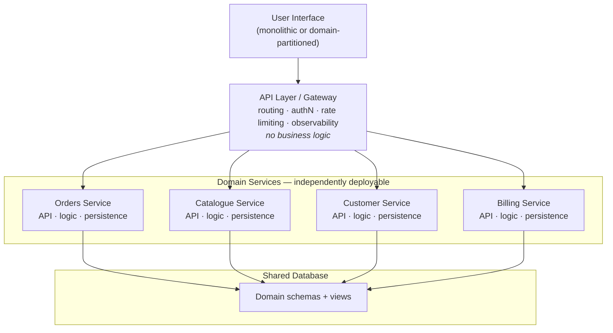

# ADR-001: Adopt Service-Based Architecture
 
| Field | Value |
|---|---|
| **Status** | Proposed |
| **Date** | 2026-08-05 |
| **Deciders** | *[Architecture group / tech leads]* |
| **Consulted** | *[Platform, SRE, Security, Data]* |
| **Informed** | *[Engineering org, Product]* |
| **Supersedes** | — |
| **Superseded by** | — |
 
---
 
## 1. Context
 
*[Replace the bracketed text with your specifics — the rest holds for most teams choosing this style.]*
 
The current system is a *[single deployable monolith / set of ad-hoc services]* serving *[N]* users across *[M]* business domains, maintained by *[K]* teams.
 
Forces driving a decision now:
 
- **Deployment coupling.** A change to any module requires a full-system release and regression cycle, so release cadence is capped at *[e.g. once every two weeks]* regardless of how small the change is.
- **Blast radius.** A defect in one module (e.g. reporting) can exhaust shared resources and take down unrelated critical paths (e.g. checkout).
- **Team contention.** Multiple teams merge into one deployment pipeline, producing queueing, merge conflicts, and coordination overhead that grows superlinearly with headcount.
- **Uneven change rates.** *[Domain A]* changes weekly; *[Domain B]* changes twice a year. They are forced onto the same release train.
- **Constraints against full decomposition.** The data model is highly relational with *[N]* cross-domain foreign keys and joins; several workflows require ACID guarantees across what would become service boundaries. The organisation does not currently have the operational maturity (service mesh, distributed tracing, on-call per service, automated provisioning) that fine-grained microservices demand.
We therefore need an architecture that buys **independent deployability and fault isolation at the domain level** without paying the cost of **distributed data management and distributed transactions**.
 
## 2. Decision
 
**We will adopt a service-based architecture.**
 
Concretely:
 
1. **Coarse-grained domain services.** The system is partitioned into a small number of independently deployed services — target **4–12**, one per business domain (e.g. *[Orders, Catalogue, Customer, Billing, Reporting]*). Each service contains the full technical stack for its domain (API, business logic, persistence access). Services are *portions of the application*, not single-purpose functions.
2. **Shared database.** Services continue to share a single relational database. Cross-domain queries and ACID transactions within a domain boundary are preserved. Each service accesses only the tables it owns, plus explicitly agreed read-only tables.
3. **Logical schema partitioning.** The database is partitioned into logical schemas per domain, with **database views** exposed to services that need another domain's data. This decouples services from table-level changes and creates a migration path if we later need physical database separation.
4. **Optional API layer.** A lightweight API layer (reverse proxy / gateway) sits in front of the services to handle routing, authentication, rate limiting, and observability. It contains **no business logic and no orchestration** — it is not a mediator or ESB.
5. **User interface.** The UI is *[a single monolithic front end / partitioned by domain]*, calling services directly through the API layer.
6. **Inter-service communication is the exception.** Services should be self-contained enough to satisfy a request without calling siblings. Where unavoidable, calls are *[synchronous REST / asynchronous messaging]* and must be documented in the service contract. Chained calls more than one hop deep are prohibited.
### Target topology
 

 
## 3. Alternatives Considered
 
| Option | Why not chosen |
|---|---|
| **Keep the layered monolith** | Does not address deployment coupling, blast radius, or team contention — the primary drivers. Lowest cost, but the costs we are trying to eliminate are not financial. |
| **Modular monolith** | Improves modularity and is cheaper, but leaves a single deployment unit: no independent release cadence and no runtime fault isolation. A reasonable fallback if the team cannot fund service-level CI/CD. |
| **Microservices** | Delivers the strongest deployability, scalability, and elasticity, but requires decomposing the shared database into a database-per-service, eliminating cross-domain joins and ACID transactions. Given our relational coupling and current operational maturity, the migration cost and distributed-systems complexity are not justified by current scale requirements. |
| **Service-oriented architecture (ESB-based)** | Heavyweight mediation and centralised orchestration reintroduce a single coordination bottleneck and a shared, hard-to-evolve integration layer. |
| **Event-driven architecture** | Excellent scalability and responsiveness, but eventual consistency and choreographed workflows are a poor fit for our transactional, request/response business processes. May be adopted *within* a service later. |
| **Serverless / microkernel** | Do not match our workload profile *[long-running, stateful, transactional]*. |
 
## 4. Consequences
 
### Positive
 
- Each domain service is deployed on its own cadence; release risk is scoped to one domain.
- A failure or resource exhaustion in one service does not by default take down the others (fault isolation at the service level).
- ACID transactions and referential integrity are retained — no sagas, no distributed transaction coordination, no eventual-consistency reconciliation logic.
- Testing scope shrinks: a domain change requires regression of that domain plus its documented contracts, not the whole system.
- Team ownership maps cleanly to services; teams can work with far less cross-team coordination.
- Significantly cheaper and faster to reach than microservices — this style is commonly a pragmatic first step and a viable end state.
### Negative
 
- **The shared database is a single point of failure and a coupling point.** A schema change can break multiple services; the database becomes the chief constraint on evolution.
- **Database change is now a governance problem.** Migrations require coordination, versioning, and a compatibility policy that did not previously exist.
- **Elasticity and granular scaling are limited.** We scale whole domains, not individual operations; a single hot function forces us to scale its entire service.
- **Operational surface grows.** *[N]* pipelines, *[N]* deployment targets, *[N]* sets of dashboards and alerts instead of one.
- **Boundaries are hard to reverse.** Getting domain partitioning wrong produces chatty inter-service calls and shared-logic duplication. Boundaries must be validated before they are frozen.
- **Distributed debugging.** Request tracing across the API layer and services requires correlation IDs and distributed tracing from day one.
### Neutral / Follow-on
 
- Migration to microservices remains available later, service by service, by carving the shared database along the schema boundaries established here.
- Each service may internally adopt whatever style suits it (layered, hexagonal, event-driven) — this ADR constrains only the macro architecture.
## 5. Architecture Characteristics
 
Indicative ratings for this style (5 = strongest; *Overall cost* and *Simplicity* rated so that 5 = cheapest/simplest). Adapted from the service-based style as described in Richards & Ford, *Fundamentals of Software Architecture* — treat these as a starting point for your own scoring, not as fixed values.
 
| Characteristic | Rating | Note |
|---|---|---|
| Deployability | ★★★★☆ | Domain-level, not function-level |
| Testability | ★★★★☆ | Scoped to a domain |
| Modularity | ★★★★☆ | Domain-partitioned |
| Evolvability | ★★★★☆ | Constrained by the shared database |
| Fault tolerance | ★★★★☆ | Service isolation; database remains a SPOF |
| Reliability | ★★★★☆ | Fewer network hops than microservices |
| Overall cost | ★★★★☆ | Materially cheaper than microservices |
| Simplicity | ★★★☆☆ | Distributed, but few moving parts |
| Performance | ★★★☆☆ | Minimal inter-service chatter by design |
| Scalability | ★★★☆☆ | Coarse-grained |
| Elasticity | ★★☆☆☆ | Not a strength of this style |
 
**Explicitly traded away:** fine-grained elasticity and per-operation scalability, in exchange for data integrity, simplicity, and cost.
 
## 6. Implementation Notes
 
- **Granularity rule of thumb:** if a service needs to call a sibling to complete an ordinary request, the boundary is probably wrong.
- **Database access:** each service owns its schema. Reads across domains go through views owned by the producing domain. No service writes to another domain's tables.
- **Contracts:** every service publishes a versioned API contract *[OpenAPI]*. Breaking changes require a deprecation window of *[e.g. 2 releases]*.
- **Shared code:** cross-cutting concerns (auth, logging, tracing) are distributed as versioned libraries; business logic is never shared between services.
- **Observability:** correlation IDs propagated from the API layer through every service; distributed tracing enabled before the first service is split out.
- **Migration sequencing:** extract the domain with the *highest change rate and lowest data coupling* first, to validate the pipeline and the boundary approach with the least risk.
## 7. Compliance and Enforcement
 
- Automated fitness functions in CI verify: no cross-schema table access, no inter-service call chains deeper than one hop, no business logic in the API layer.
- Dependency checks *[e.g. ArchUnit / import-linter]* fail the build on illegal package or module dependencies.
- Architecture review at *[quarterly]* intervals reassesses service count and boundaries against actual change and traffic patterns.
## 8. Review Triggers
 
Revisit this decision if any of the following occur:
 
- Database schema coordination becomes the dominant source of release delay.
- A single domain requires independent scaling at a granularity finer than the service.
- Service count exceeds *[12]*, indicating drift toward microservices without the supporting infrastructure.
- Inter-service call volume exceeds *[X%]* of total request volume, indicating incorrect boundaries.
