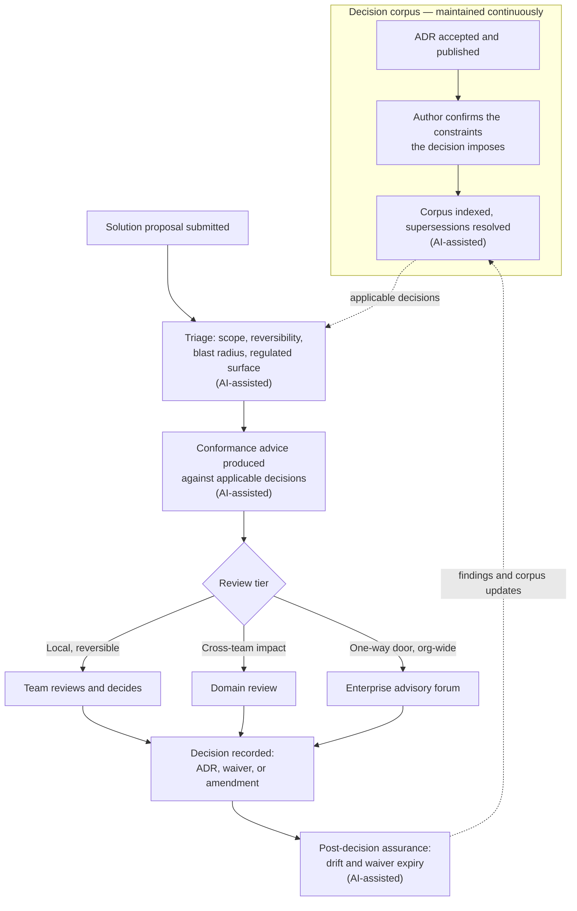

# AI-Augmented Architecture Review — Process Design
 
*How AI advisory capability is incorporated into the federated architecture review process.*
 
---
 
## 0. Purpose and scope
 
This document defines the **process**: the stages of review, what each stage produces, where AI capability contributes advice, and who holds decision authority at each point.
 
It deliberately contains **no implementation detail** — no agent design, tooling, technology selection, or evaluation mechanics. Those are addressed in the companion document, *AI-Augmented Architecture Review — Implementation Design*, and are subject to a separate decision. The process defined here must remain valid if the underlying technology is replaced.
 
---
 
## 1. Governing principle
 
The federated model separates two things: **authority** — who decides — and **advice** — who informs the decision. AI capability sits entirely on the advice side.
 
Every stage below treats AI as **an advisor that produces evidence**, never as a gate that produces approvals. This is not caution for its own sake. A capability that blocks work will be routed around within a quarter. A capability that reliably tells a reviewer *"this proposal contradicts ADR-007 clause 3, and here is the evidence"* is used voluntarily, which is the only adoption that lasts.
 
Three rules follow, and they are not negotiable within this process:
 
1. **No proposal is approved or rejected by automated means.** AI produces findings; humans produce decisions.
2. **A named human reviewer owns every published finding set.** "The system said so" is not an acceptable rationale in a decision record.
3. **Automated advice is always attributable.** Every finding identifies the specific decision clause it relates to and the specific evidence in the proposal.
---
 
## 2. The review process end to end
 

 
### Stage 1 — Decision publication
 
**Trigger:** an ADR reaches accepted status.
 
The corpus is only as useful as its structure. On publication, the **ADR author confirms the specific constraints their decision imposes** — the individually checkable obligations, and the conditions under which each applies. AI capability proposes this breakdown; the author confirms or corrects it before the decision enters the corpus.
 
This author-confirmation step is a required part of ADR publication, not an optional extra. It is the cheapest available control on the accuracy of everything downstream: an author spending ten minutes confirming what their own decision requires removes an entire class of later error.
 
**Accountable:** ADR author. **Output:** published decision with confirmed constraints, supersession relationships resolved.
 
### Stage 2 — Proposal intake
 
**Trigger:** a team submits a solution architecture for review.
 
The proposal is normalised into a reviewable record covering design documents, diagrams, interface and event contracts, infrastructure definitions, and repository context.
 
**Accountable:** proposing team. **Output:** a complete proposal record.
 
### Stage 3 — Triage and routing
 
The proposal is assessed against the published triage criteria — reversibility, blast radius, regulated surface, standards conformance, and cost threshold — producing a **recommended review tier with rationale**, together with the list of parties who owe advice under the advice process.
 
AI capability produces the recommendation. **The reviewer or domain architect confirms or overrides the tier**, and any override is recorded.
 
Identifying affected parties is worth calling out separately: authors consistently under-identify who is affected by their proposal, and this is a chronic and largely invisible failure of federated review. Systematic identification is one of the clearest gains available here.
 
**Accountable:** domain architect. **Output:** confirmed tier, reviewer assignment, advice list.
 
### Stage 4 — Conformance advice
 
The proposal is evaluated against the decisions that actually apply to it. Findings are produced **per decision clause**, not per document — a proposal can satisfy four clauses of an ADR and violate a fifth, and a whole-document verdict conceals exactly the finding that matters.
 
Each finding carries one of five outcomes:
 
| Finding | Meaning | Process response |
|---|---|---|
| **Conformant** | Satisfies the constraint, with evidence | Noted; no action |
| **Deviation** | Contradicts the constraint, with the conflict located | Reviewer adjudicates: remediate, waive, or amend the decision |
| **Waiver required** | Deviates for a reason that may be legitimate | Routed to the exception path with an expiry date |
| **Not applicable** | The decision's applicability conditions are not met | Excluded, with the reason stated |
| **Insufficient evidence** | The proposal does not say enough to judge | Returned to the author as a specific question |
 
**Insufficient evidence is a first-class outcome, not a failure of the tool.** A process that offers no way to abstain will receive confident guesses instead, and one confident wrong finding costs more reviewer trust than ten honest abstentions. The rate at which this outcome is used is monitored as a health signal.
 
Findings assessed as high severity are reviewed by a human before publication. All others are published directly to the review record as advice.
 
**Accountable:** assigned reviewer, who owns the published finding set. **Output:** findings report attached to the review record.
 
### Stage 5 — Human review
 
The proposal proceeds to its tier — team, domain, or enterprise forum — with the findings report as a pre-read alongside precedent from comparable past decisions.
 
Reviewers retain full authority to disagree with any finding. **Disagreements are recorded**, because they are the primary evidence for whether the advice is worth continuing to produce.
 
The forum's own role is unchanged by this process: it exists to give advice on trade-offs where legitimate values conflict, which is exactly the judgement that automated conformance checking cannot make and should not attempt.
 
**Accountable:** the tier's decision-maker. **Output:** decision, with advice received and dissent recorded.
 
### Stage 6 — Decision recording
 
The outcome is recorded as a new ADR, a waiver with an expiry date, or an amendment to an existing decision.
 
**Every deviation has a third available response beyond "fix it" and "waive it": amend the decision.** If a proposal deviates because the published standard is wrong, the correct outcome is to change the standard. Without this path, the process systematically entrenches existing decisions against better ideas — see §4.
 
**Accountable:** decision-maker. **Output:** published record, notified parties.
 
### Stage 7 — Post-decision assurance
 
Continuously thereafter:
 
- **Drift detection** — conformance is re-assessed against the system as actually built, catching the gap between what was approved and what was delivered.
- **Waiver expiry** — owners are notified before lapse; expired waivers escalate. Expired-but-live waivers are the most common quiet failure of architecture governance.
- **Decision staleness** — each ADR's own review triggers are monitored against live measurements, so a decision that says "revisit if service count exceeds twelve" raises itself when the count reaches twelve.
- **Portfolio analysis** — recurring deviations are clustered. Five teams requesting the same waiver is not five violations; it is one wrong standard, and this is the single highest-value signal the process can produce for an Enterprise Architect.
**Accountable:** Enterprise Architecture. **Output:** assurance reporting, corpus updates, standards amendments.
 
---
 
## 3. Where AI contributes across the lifecycle
 
Beyond the core flow, AI capability can advise at these points. Stages 3, 4 and 7 above are the priority; the rest form the adoption roadmap in §5.
 
| Point in lifecycle | Contribution |
|---|---|
| **ADR authoring** | Draft from design notes; check the record states alternatives with reasons for rejection, names negative consequences, and sets measurable review triggers; detect overlap or contradiction with existing decisions before submission |
| **Corpus curation** | Maintain supersession relationships; scan for contradictions between decisions; flag decisions whose own review triggers have been breached |
| **Triage** | Recommend review tier; identify affected parties owing advice |
| **Conformance** | Produce clause-level findings with cited evidence |
| **Challenge** | Argue against the proposal — strongest objection, failure modes, what this makes irreversible. Presented explicitly as advocacy, not assessment |
| **Perspective review** | Separate narrow reviews for security, cost, operability, and data governance, each against its own subset of decisions |
| **Precedent** | Surface comparable past proposals and their outcomes, ending re-litigation of settled questions |
| **Forum support** | Pre-reads; agenda prioritised by risk and reversibility; session captured into a draft record including dissent |
| **Assurance** | Drift detection, waiver expiry, staleness, portfolio analytics |
 
---
 
## 4. Guardrails
 
**Advisory only.** No automated approval or blocking. Any future move toward automated gating is a separate decision requiring its own ADR and its own risk case.
 
**Human ownership.** A named reviewer owns every published finding set. Accountability does not transfer to a tool.
 
**Attribution.** Every finding cites the decision clause and the evidence supporting it. Findings without both are not published.
 
**Challenge path.** Any deviation may be escalated as a proposal to amend the decision rather than a fault to be corrected. Without this, the process biases structurally toward the status quo and disadvantages proposals that are better than current standards.
 
**No bare passes.** Reports always state what was checked, what was abstained on, and what fell outside scope. A clean report with no visible scope invites reviewers to stop reading the proposal — and automation complacency is a more realistic risk than automation error.
 
**Untrusted input.** Submitted proposals are treated strictly as material to be assessed, never as instruction to the reviewing capability. Anomalous results — an all-conformant outcome on a substantial proposal, for instance — are flagged for human attention.
 
**Auditability.** Inputs, outputs, and human adjustments are logged and reproducible. In regulated contexts the review trail is the deliverable.
 
**The capability is itself subject to this process.** Adopting it is an architecture decision with consequences, alternatives, and review triggers, and it is recorded as an ADR like any other. Being seen to follow our own process is most of what makes governance credible.
 
---
 
## 5. Adoption stages
 
| Stage | Capability | Precondition |
|---|---|---|
| **1** | Question-answering over the decision corpus | Published, indexed decisions |
| **2** | Triage recommendation and pre-read generation | Documented triage criteria |
| **3** | Clause-level conformance advice on submitted proposals | Author-confirmed constraints; demonstrated accuracy |
| **4** | Drift detection against the delivered system | Access to live system definitions |
| **5** | Perspective and challenge reviews | Sustained accuracy at stage 3 |
| **6** | Automated handling of low-risk decisions with sampling audit | Separate governance decision |
 
Most of the value lands at **stage 3**, and stopping there for an extended period is a legitimate outcome. Stage 6 is not a natural destination — it is a distinct decision to withdraw human review from a defined slice of work, and it requires its own risk case rather than arriving by momentum.
 
---
 
## 6. Process metrics
 
**Flow:** review cycle time; escalation rate; proportion of proposals receiving automated advice; advice-response latency.
 
**Advice quality:** how often reviewers disagree with findings; how often findings prove correct; abstention rate; volume of unhelpful findings per review.
 
**Governance health:** proportion of proposals covered by any published decision; waiver count and age; recurring deviation clusters; decisions past their review triggers.
 
**The reviewer disagreement rate is the most important single measure.** A sustained rise means the corpus, the constraints, or the capability has drifted — and it surfaces well before anyone reports that the advice has stopped being useful.
 
---
 
## 7. Out of scope
 
The following are addressed in the companion implementation document and require separate decisions:
 
- Agent design, technology selection, and hosting
- How decision constraints are represented and retrieved
- Accuracy evaluation method and acceptance thresholds
- Integration with intake, pipelines, and collaboration tooling
- Data confidentiality and retention arrangements
