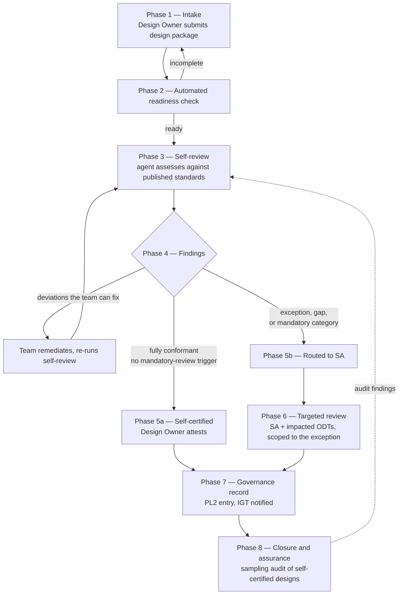

# Architecture Review — Federated Self-Review Process
 
*An enhancement of the existing Architecture Review – Manual Tracking process. The manual process remains the fallback path; this document defines the self-review path and the conditions under which a design leaves it.*
 
---
 
## Overview
 
The current process routes **every** proposed solution through the Solution Architecture team, regardless of whether the design raises any architectural question at all. A design that conforms fully to published standards consumes the same review capacity as one that does not.
 
The federated process inverts the default. Teams **self-review their designs against published architectural standards using an AI agent**, and the Solution Architecture team engages only where the self-review surfaces an exception, a gap in the standards, or a category that requires human judgement by policy.
 
Two things do not change:
 
- **Accountability remains human.** The agent produces findings; a named design owner attests to the submission, and a named Solution Architect owns any exception review. No design is approved by automated means.
- **The governance record is unchanged.** Jira tracking, PL2 recording, and IT Governance approval continue to apply. The evidence reaching them is richer, not thinner.
### What changes
 
| Today | Federated |
|---|---|
| Every ARR goes to SA for review | SA reviews only exceptions, gaps, and mandatory-review categories |
| SA performs the readiness check manually | Readiness is checked automatically at intake; incomplete submissions never reach a person |
| SA identifies impacted ODTs, sometimes during the review meeting | Impacted ODTs are identified automatically at intake from the design content |
| Conformance is assessed from reviewer knowledge | Conformance is assessed against published standards, clause by clause, with cited evidence |
| Review outcome depends partly on which SA is assigned | Assessment is consistent; SA judgement is applied to exceptions, which is where it is worth applying |
| Non-conformance is found in review, late | Non-conformance is found by the team, before submission |
| Review capacity is the bottleneck | Standards coverage is the bottleneck — a more tractable problem |
 
---
 
## Process
 
The federated process involves the same four user groups — **APT** (Application Portfolio Team), **SA** (Solution Architecture Team), **ODT** (Operational Domain Teams), **IGT** (IT Governance Team) — plus one new named role:
 
- **Design Owner** — the team-side architect or lead who runs the self-review and attests to the submission. This role exists today informally; the federated process makes it explicit and accountable.
Tools are unchanged — intake form, Jira, PL2 — with the addition of the **Architecture Review Agent**, which reads the design package, assesses it against published standards, and writes its findings back to the Jira parent task.
 
### Flow
 

 
### Phase 1 — Intake and automatic scoping
 
- **[Design Owner]** Submits the design package via the intake form: design document, diagrams, interface and event contracts, infrastructure definitions, and data classification.
- **[Automated]** Creates the Jira parent task from the submission, applies label `ar-self-review`, and populates the description from the template — removing the manual task creation step that currently sits with SA.
- **[Automated]** Identifies **impacted ODTs** from the design content and creates the corresponding sub-tasks, each with an identified ODT contact.
> Today the impacted ODTs are identified by SA, sometimes only during the review meeting. Determining this at intake removes a scheduling dependency from the critical path and is one of the larger cycle-time gains available, independent of anything else in this process.
 
### Phase 2 — Automated readiness check
 
- **[Automated]** Assesses the submission for completeness against the readiness checklist: required documentation present, data classification stated, integration points identified, non-functional requirements stated.
- **[Automated]** If incomplete, returns to the Design Owner with the **specific** items missing. This loop runs without consuming SA capacity, and repeats until ready.
- **[Design Owner]** Supplies missing items and resubmits.
*This replaces the current Phase 2 manual readiness decision by SA. SA is not involved in any incomplete submission.*
 
### Phase 3 — Self-review against published standards
 
- **[Automated]** Retrieves the published standards applicable to this design and assesses the design against each applicable clause, producing a finding per clause:
| Verdict | Meaning |
|---|---|
| **Conformant** | Satisfies the clause, with cited evidence from the design |
| **Deviation** | Contradicts the clause, with the conflict located in the design |
| **Exception claimed** | Deviates, and the design invokes a published exception path |
| **Not applicable** | The standard's applicability conditions are not met |
| **Insufficient evidence** | The design does not say enough to assess |
 
- **[Automated]** Writes the findings report to the Jira parent task, and applies the outcome label.
- **[Design Owner]** Reviews the findings.
**Insufficient evidence is a first-class outcome.** A design that cannot be assessed is not conformant — it is under-specified, and it returns to the team as a specific question rather than proceeding on an assumption.
 
### Phase 4 — Remediation loop
 
- **[Design Owner]** For each deviation, either remediates the design or prepares an exception case.
- **[Design Owner]** Re-runs the self-review. This loop runs entirely within the team, as many times as needed, with no SA involvement and no scheduling.
> This is where the cycle-time benefit is actually realised. Today, a design with three straightforward standards deviations waits for a review meeting to be told about them. Here the team finds and fixes them the same day.
 
### Phase 5 — Routing
 
The self-review outcome determines the path. **The Design Owner does not choose the route** — it follows from the findings.
 
**5a — Self-certified path.** All applicable clauses conformant, no mandatory-review trigger present.
 
- **[Design Owner]** Attests to the submission: confirms the design package is complete and accurate, and that no material change is pending. The attestation is recorded in Jira against a named individual.
- **[Automated]** Applies label `ar-self-certified`. Proceeds to Phase 7 without SA review.
- **[Automated]** Adds the design to the sampling pool for Phase 8 assurance.
**5b — Manual review path.** Any of the following routes the design to SA:
 
| Trigger | Rationale |
|---|---|
| **E1 — Deviation with a published exception path** | The exception's qualifying conditions must be verified by a human |
| **E2 — Deviation with no published exception path** | Requires a decision, not an assessment |
| **E3 — No applicable standard** | Novel territory. Absence of a finding is not conformance, and this is the case an automated assessment is least equipped to judge |
| **E4 — Insufficient evidence after remediation attempts** | The design cannot be assessed as submitted |
| **E5 — Mandatory-review category** | Applies regardless of conformance: *[regulated or sensitive data; customer-facing security boundary changes; one-way-door decisions; spend above threshold; changes affecting more than N ODTs; first design in a new domain]* |
 
> E5 is what prevents the federated path from being an unconditional escape hatch. Some designs warrant human review because of what they are, not because of what a standards check found — and a fully conformant design can still be a bad one.
 
### Phase 6 — Targeted manual review (SA and ODT)
 
Runs only for designs routed by 5b. **Scoped to the exception, not the whole design** — the conformant portions are evidenced and are not re-reviewed.
 
- **[SA]** Applies label `ar-exception-review`, schedules the review if a meeting is warranted. Many exceptions are resolvable asynchronously in Jira, and the meeting should not be automatic.
- **[SA]** Reviews the exception with the findings report and evidence pack as the pre-read. The review starts at the disagreement rather than at the recap.
- **[ODT Contact]** Performs technical review of the impacted domain and records the decision in the ODT sub-task. Where a sub-task's domain is fully conformant with no exception, the ODT is informed rather than asked to review.
- **[SA]** Documents the ODT summary and the exception decision on the parent task. Moves forward ONLY after approval.
- **[SA]** Where the outcome is that the **standard is wrong**, raises it as a proposal to amend the standard rather than granting a one-off waiver. Repeated identical exceptions are a signal about the standard, not about the teams requesting them.
### Phase 7 — Governance record
 
- **[Automated]** Generates the evidence pack: findings report, remediation history, attestation or exception decision, ODT decisions.
- **[APT Requestor]** Creates the PL2 entry, pre-populated from the evidence pack.
- **[Automated]** Creates the IT Governance sub-task and notifies IGT.
- **[IGT Contact]** Conducts governance review and records the decision. Where rework is required, the design returns to SA/APT/ODT as today.
- **[SA]** Documents the final IT Governance decision on the parent task. Move forward ONLY after approval.
> Whether self-certified designs warrant a lighter governance touch — attestation rather than full review — is a decision for IGT, not one this process should presume. It is flagged in §Open Decisions.
 
### Phase 8 — Closure and assurance
 
- **[SA]** Adjusts the label to `ar-complete` and closes the Jira tasks.
- **[SA]** **Samples self-certified designs** — *[10–20%]*, weighted toward higher-risk categories — and reviews them fully.
Sampling is not optional. A self-review path with no audit has no way to detect false negatives, because a design that was wrongly cleared generates no signal until it fails in production. The sampling rate is the primary control on the whole model, and it is the number to defend if it comes under pressure.
 
- **[SA]** Feeds audit findings back into the standards and the agent's assessment coverage.
---
 
## RACI
 
| Activity | Design Owner | APT Requestor | SA | ODT Contact | IGT Contact | Automated |
|---|---|---|---|---|---|---|
| Submit design package | R | R | I | — | — | S |
| Create Jira task and sub-tasks | I | I | I | I | — | **S** |
| Readiness check | R | C | — | — | — | **S** |
| Identify impacted ODTs | C | — | I | I | — | **S** |
| Self-review against standards | R | C | I | — | — | **S** |
| Remediate deviations | R | C | — | — | — | S |
| Self-certification attestation | **A** | C | I | I | — | — |
| Routing to manual review | I | I | A | I | — | **S** |
| Exception review | C | C | **A** | C | I | S |
| ODT technical review | C | I | C | **A** | — | S |
| Notify APT of results | I | R | A | — | — | S |
| Create PL2 entry | I | **R** | A | — | I | S |
| Governance review | I | I | C | C | **A** | S |
| Final documentation approval | I | I | R | C | **A** | S |
| Sampling audit | I | — | **A** | C | I | S |
| Close review / Jira tasks | I | I | **R** | I | I | S |
 
**Legend:** R = Responsible (performs the work) · A = Accountable (owns the outcome / final decision) · C = Consulted (provides input) · I = Informed (kept updated) · **S = System-supported** (the agent performs or drafts the work; a human in the R or A column remains accountable)
 
> The agent appears only in the S column, never in R or A. **Automation is never accountable.** Where the agent drafts, a human owns; where the agent assesses, a human attests. This is deliberate and should survive any future expansion of automated scope.
 
---
 
## Workflow States
 
The Jira parent task carries one high-level state. Sub-task count continues to vary with the number of impacted ODTs.
 
| Label | Meaning | Set by |
|---|---|---|
| `ar-intake` | Submitted, readiness not yet confirmed | Automated |
| `ar-self-review` | Readiness confirmed; conformance assessment in progress or findings issued | Automated |
| `ar-remediation` | Team is addressing findings | Design Owner |
| `ar-self-certified` | Conformant, attested, no manual review required | Automated on attestation |
| `ar-exception-review` | Routed to SA under an E1–E5 trigger | SA |
| `ar-governance` | With IT Governance | Automated |
| `ar-audit` | Selected for sampling audit | SA |
| `ar-complete` | Closed | SA |
 
Existing labels `ar-in-progress` and `ar-complete` are retained; `ar-in-progress` maps to the manual path and is now equivalent to `ar-exception-review`.
 
---
 
## Guardrails
 
**The agent advises; humans decide.** No design is approved by the agent. Self-certification is a *human attestation* supported by automated evidence, and the distinction is not cosmetic — it is what makes the accountability chain hold.
 
**Attestation is attributable.** A named individual attests. "The tool cleared it" is not a defence in a post-incident review, and the process should be explicit about that from the start.
 
**Conformance is not sufficiency.** A design can satisfy every published standard and still be poor. E3 and E5 exist because absence of findings is not evidence of a good design, and teams should be told this plainly rather than left to infer it.
 
**Standards coverage is published and visible.** Teams can see which areas have standards and which do not. An area with no standard routes to SA rather than passing by default.
 
**Findings cite evidence.** Every finding identifies the standard clause and the specific place in the design. Findings without both are not issued.
 
**Sampling audit is non-negotiable**, at a rate set by Enterprise Architecture and not by delivery pressure.
 
**Designs are untrusted input.** Submitted material is assessed, never treated as instruction to the agent. Anomalous outcomes — a fully conformant assessment on a large or complex design — are flagged for human attention.
 
**The standard can be wrong.** Any deviation may be escalated as a proposal to amend the standard. Without this path the process entrenches current standards against better designs, and teams will experience it as an obstacle rather than a service.
 
---
 
## Prerequisites
 
The federated path cannot open until these are in place:
 
1. **Standards published in assessable form.** Each standard broken into individually checkable clauses with stated applicability conditions, confirmed by the standard's owner. This is the critical-path prerequisite and the largest single effort.
2. **Documented mandatory-review categories (E5)**, agreed with SA, IGT, and Security.
3. **Readiness checklist formalised** from current SA practice — much of it is presently tacit.
4. **ODT impact rules** defined well enough to identify impacted domains from design content.
5. **Accuracy baseline established** against past reviews, including how often two reviewers reach the same conclusion on the same design.
6. **Design Owner role named** in each participating team.
---
 
## Measures
 
**Flow:** proportion of designs self-certified; cycle time by path; remediation loops per design; SA review hours per design.
 
**Quality:** sampling audit pass rate *(the key measure — it is the false-negative signal)*; SA override rate on agent findings; defects traced to designs that were self-certified.
 
**Standards health:** proportion of designs routed E3 (no applicable standard); recurring E1/E2 clusters indicating a standard needs amendment; standards coverage by domain.
 
**A rising SA override rate or a falling sampling audit pass rate is the signal to narrow the self-certified path.** Both should be reviewed monthly during rollout, and the process should have a pre-agreed threshold at which the path narrows automatically rather than by negotiation.
 
---
 
## Rollout
 
| Stage | Scope |
|---|---|
| **1 — Shadow** | Agent runs on designs already going through the manual process; findings compared against SA outcomes. No routing change. |
| **2 — Assisted** | Findings issued to teams as a pre-submission aid. All designs still go to SA. |
| **3 — Federated pilot** | Self-certified path opens for *[one or two domains]* with a high sampling rate *[50%]*. |
| **4 — General** | Extended to all domains; sampling rate reduced to steady state once the audit pass rate supports it. |
 
Stage 1 is where the accuracy question is answered, and it costs nothing but time — the manual process runs unchanged throughout.
 
---
 
## Open Decisions
 
These need answers from the owning groups before the process is finalised:
 
- **Does IGT accept a lighter governance touch for self-certified designs**, or does full governance review apply regardless of path?
- **Where does the E5 threshold sit** for spend, data classification, and ODT count?
- **What sampling rate** does SA consider defensible at steady state, and what audit pass rate triggers narrowing the path?
- **Who owns the standards corpus** and the clause-level breakdown — SA, EA, or the domain owning each standard?
- **Is PL2 entry creation still an APT responsibility** once it can be generated from the evidence pack?
---
 
> **Note on sources.** The current-state description in this document was reconstructed from a photograph of the *Architecture Review – Manual Tracking* Confluence page. Phase and role details, and particularly the RACI values and the third tool name, should be verified against the source page before this is published.
